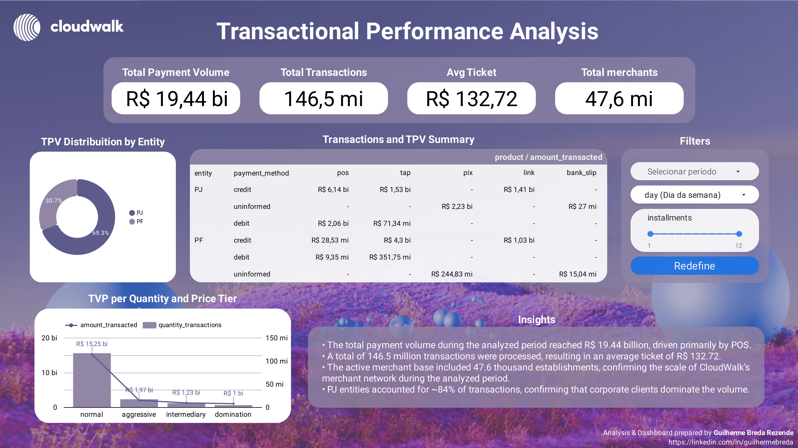
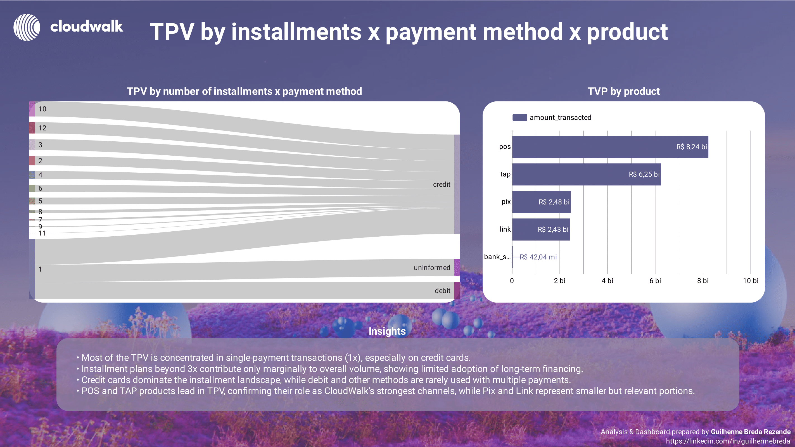
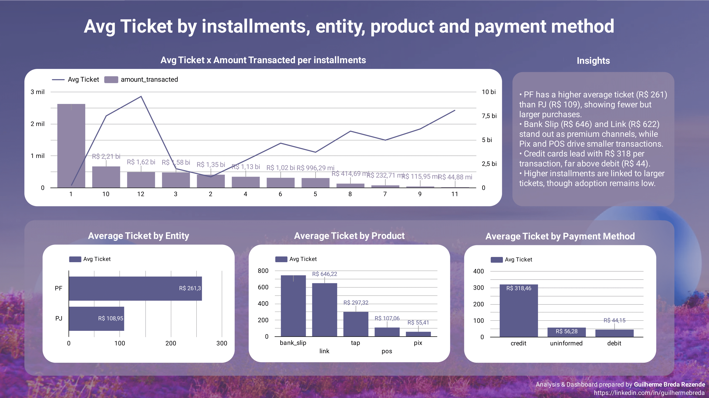
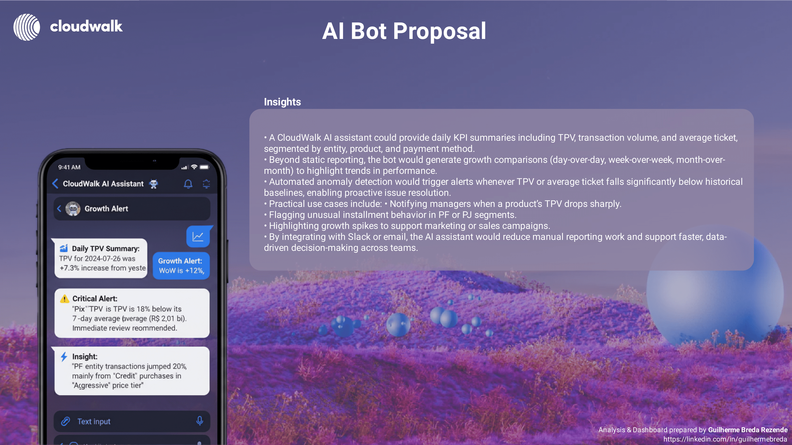
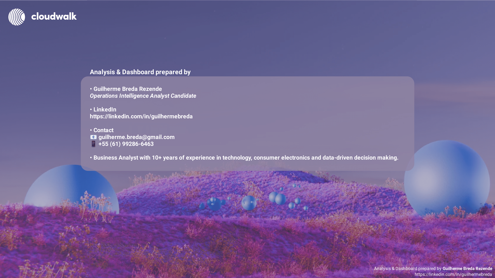

# Operations Intelligence Analyst Challenge

This repository contains my submission for the **Operations Intelligence Analyst** technical challenge.

## Introduction

Hi, my name is **Guilherme Breda Rezende**, and this repository contains my solution for the **Operations Intelligence Analyst Challenge**.  

My approach combined **exploratory data analysis in Python** (to understand transaction patterns, KPIs, and anomalies) with an **interactive dashboard in Google Looker Studio** (to deliver clear, executive-friendly insights). I also proposed an **AI-powered assistant** to automate KPI tracking and anomaly detection, turning daily operations into actionable intelligence.  

This work reflects not only the technical execution of the challenge but also how I approach **data-driven problem solving, business storytelling, and automation opportunities**.

## 📊 Dataset
- [Operations_analyst_data.csv](Operations_analyst_data.csv) — transaction dataset provided for the challenge.

## 📓 Exploratory Analysis
- [exploratory_analysis.ipynb](exploratory_analysis.ipynb) — Jupyter Notebook with initial exploration, KPI calculations, and visualizations.

## 📈 Interactive Dashboard
- Built in **Google Looker Studio**.  
- [View the Dashboard here](https://lookerstudio.google.com/reporting/7324f2fd-ef5b-4bee-a209-89c83a980bcd)  
- Includes KPIs, segment analysis, transactional behavior, anticipation methods, and AI bot proposal.

## 🖼️ Screenshots
- `screenshots/` — sample views of the dashboard (for quick preview).

### Page 1 — Overview (KPIs)

### Page 2 — Segments (Installments, Payment Method & Product)

### Page 3 — Transactional Behavior (Avg Ticket Analysis)

### Page 4 — AI Bot Proposal

### Page 5 — About / Author

## 🤖 AI Assistant Proposal
- Concept for an AI bot to deliver daily KPI updates, anomaly alerts, and growth insights directly to Slack or email.

## 📌 Author
Analysis & Dashboard prepared by **Guilherme Breda Rezende**  
🔗 [LinkedIn](https://www.linkedin.com/in/guilhermebreda)

📧 `guilherme.breda@gmail.com`
